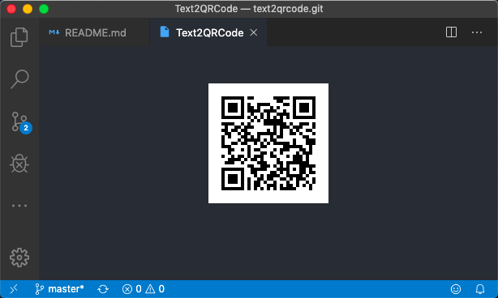

# Text2QRCode

A vscode extension generates qrcode from text.

# Usage

- Select text
- Right click menu -> Text2QRCode
- Display QRCode in new tab

# Q & A

Q: How to save qrcode image file?

A: Just drag qrcode image to desktop.

# Repository

[Ceelog/text2qrcode](https://github.com/Ceelog/text2qrcode)

# Acknowledgement

- [oldair/node-qrcode](https://github.com/soldair/node-qrcode)

- Inspired by [compulim/vscode-qrcode](https://github.com/compulim/vscode-qrcode).

**Enjoy!**
